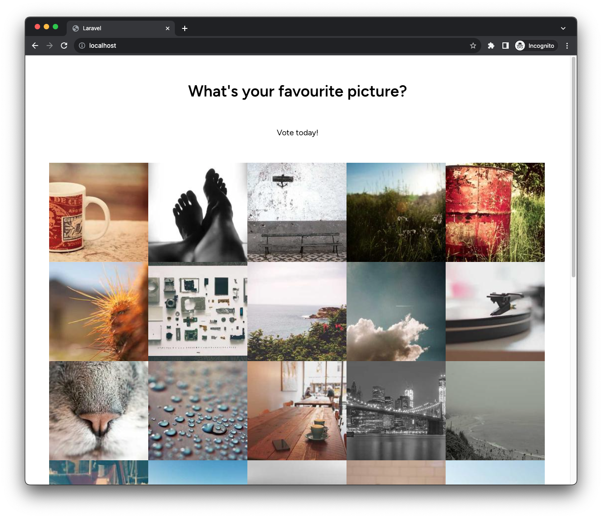

## KO Coding Challenge

This repo is a skeleton setup of a Laravel project. Your task is to add some features to it in a way that follows best practices. The project will require
you to build and manage the following parts of the stack:

-   Database Entries
-   Back-end Form Submission Handling
-   Front-end Data Display

## The Project



Your task is to create a small Voting App where people can vote on their favourite picture from a list, and the owner of the App can manage the votes.

You will need to create the following pages:

### Page 1: Pictures Index

-   This page will show a list of pictures from a known set to the `Voters`.
-   It will also show the total number of votes submitted so far and a link to
    the `Results` page via a link that says `View all results`.
-   When the `Voter` clicks on any given image, the page will navigate to the
    `View Single Image` page to get a bigger look at that image.

### Page 2: View Single Image

-   This page will show a single image from the known set of images.
-   It will also have `View Previous Picture` and `View Next Picture` links
    underneath the picture which will navigate the user to the `View Single Image` page for the previous/next picture in the set.
-   It will also show a form underneath which allows a `Voter` to submit that
    this is their favourite image.
-   The form will have three things in it:
    1. A heading that says `Vote for this image as your favourite`
    2. A `name` text field (limited to 100 input characters)
    3. A `submit` button whose text says `This is my favourite`
-   If the `name` field is not filled, the submission should not complete
    successfully and some validation message should be returned to the user on
    the page.
-   When submitted successfully, the form will post the submission to the backend to be processed

### Page 3: Results

This page will show a table with all the votes cast so far.

The table will have two columns:

-   `Name` - the names of the voters as submitted in the form on the
    `Page 2: View Single Image`
-   `Favourite Picture` - a small version of the picture that the user had voted
    upon. The picture will be a hyperlink to the `Page 2: View Single Image` for
    that image.

By default, the table will be sorted A-Z by the `name` column's contents.
The user must be able to change the sorting of the column to sort by the
`Favourite Picture` column.

## Sourcing The Pictures

Please use the images available on [`Lorum Picsum`](https://picsum.photos/images#2).

The images can be referred to by simple integer ids and can be rendered in HTML
like so:

```html

```

ie `Picture #50 at 200x200px`:

```html

```

Please use about 30 images, starting from number 30.

## Technical Notes

-   Please use the built-in Laravel skeleton project to implement this
    functionality
-   These requirements are very high-level because we want to give you the
    flexibility to implement them as you see fit.
-   Visual design is not important for this task, do whatever you need to do
    as long as the site is usable.
-   No authentication / login is required
-   Demonstrate your ability to write some tests
-   On form submission, if a user with that name already has an existing vote
    recorded, overwrite it with the new value
-   De-duplicate voters' names by being case-insensitive and whitespace-insensitive.

### Running the Laravel Project Locally

1. Checkout this repo somewhere
2. `cd` into this project's root directory and run `docker-compose up`
